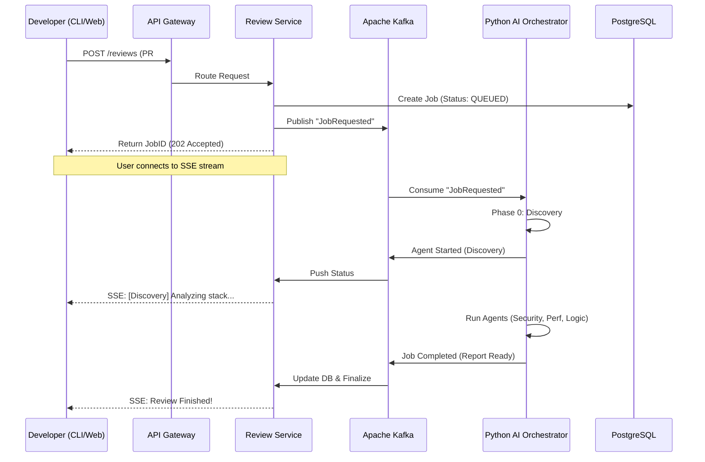

# 🛡️ MergeGuard

### **The Intelligent, Multi-Agent AI Code Review Platform**

MergeGuard is a state-of-the-art, language-agnostic code review system designed for high-performance engineering teams. Unlike generic AI wrappers, MergeGuard uses a **coordinated pipeline of specialized agents** to perform deep architectural, security, and performance analysis on Pull Requests, delivering feedback that feels like it came from a senior staff engineer.

[](https://nextjs.org/)
[](https://www.typescriptlang.org/)
[](https://www.python.org/)
[](https://github.com/langchain-ai/langgraph)
[](https://kafka.apache.org/)

---

## 📖 Table of Contents
- [✨ Core Innovation](#-core-innovation)
- [🏗️ System Architecture](#-system-architecture)
- [🤖 The AI Agent Pipeline](#-the-ai-agent-pipeline)
- [💻 Tech Stack](#-tech-stack)
- [📂 Project Structure](#-project-structure)
- [🚀 Getting Started](#-getting-started)
- [🛠️ CLI Usage](#-cli-usage)
- [🗺️ Future Roadmap](#-future-roadmap)

---

## ✨ Core Innovation

### 🔍 Zero-Config Auto-Discovery
MergeGuard does not guess what it is reviewing. It features a discovery phase that automatically detects:
- **Languages & Frameworks:** (e.g., React, Go, Django, NestJS).
- **Database Layers:** (e.g., Prisma, SQLAlchemy, Raw SQL).
- **System Type:** (e.g., Web API, ML Pipeline, Frontend, Infrastructure-as-Code).
Agents **calibrate their entire thinking** based on this context before analyzing a single line of code.

### 🤝 Human-in-the-Loop AI
Reviewers can interact with the AI summary before it's finalized. You can approve findings or provide targeted feedback (e.g., *"Focus more on the SQL queries in this PR"*) to trigger a **selective re-run** of specific agents.

### ⚡ Real-Time "Live" Feedback
Using **Server-Sent Events (SSE)**, developers can watch the AI agents work in real-time. Whether in the CLI or the Web Dashboard, you see a live progress bar as each specialized agent (Security, Perf, etc.) completes its task.

---

## 🏗️ System Architecture

MergeGuard uses an **event-driven microservices architecture** to decouple high-latency AI tasks from the user-facing API.

### **Data Flow Diagram**



---

## 🤖 The AI Agent Pipeline

Our **LangGraph-powered** orchestrator manages specialized agents:

| Agent | Responsibility | Analytical Model |
| :--- | :--- | :--- |
| **Discovery** | Environment detection | Structural reasoning & Manifest parsing |
| **Security** | Vulnerability scanning | Adversarial thinking (OWASP/CWE) |
| **Performance** | Bottleneck detection | Systems thinking (Big O, N+1 queries) |
| **Architecture** | Pattern enforcement | Structural consistency & Layered design |
| **Readability** | Clean code analysis | Empathy for future maintainers |
| **Summary** | Report synthesis | Executive communication |

---

## 💻 Tech Stack

### **Frontend (The Dashboard)**
- **Next.js 14 (App Router):** High-performance server components.
- **Tailwind CSS + Shadcn UI:** Modern, accessible design system.
- **Redux Toolkit:** Management of complex live-stream states.
- **TanStack Query:** Robust server-state caching and synchronization.

### **Backend (Microservices)**
- **Express.js + TypeScript:** Type-safe microservices with clear domain ownership.
- **Prisma ORM:** Automated migrations and type generation.
- **PostgreSQL:** Reliable persistent storage for review history and users.
- **Apache Kafka:** High-throughput event bus for service orchestration.

### **AI Core (The Orchestrator)**
- **LangGraph / LangChain:** Complex stateful workflow management.
- **Claude 3.5 Sonnet:** The primary brain for deep reasoning.
- **Jinja2:** Dynamic prompt templating based on auto-discovery context.

---

## 📂 Project Structure

MergeGuard is organized as a high-performance **Turborepo** monorepo:

```text
MergeGuard/
├── packages/
│   ├── api-gateway/       # Central entry point (Auth & Routing)
│   ├── auth-service/      # GitHub OAuth, JWT & API Key management
│   ├── review-service/    # Job lifecycle, SSE streaming & DB storage
│   ├── notification-service/ # Webhooks (Slack), Email (Resend) & GitHub
│   ├── db/                # Shared Prisma client, Schema & Migrations
│   ├── events/            # Shared Kafka producer/consumer utilities
│   ├── cli/               # Native Node.js CLI wrapper
│   └── web-dashboard/     # Next.js 14 Dashboard
├── cli/                   # Standalone Python core for CLI
├── ai-orchestrator/       # Python AI logic (LangGraph workflow)
├── docs/                  # Architectural deep-dives & PRDs
└── docker-compose.yml     # Complete infrastructure setup
```

---

## 🚀 Getting Started

### **1. Prerequisites**
- **Node.js:** 20.x or higher
- **Python:** 3.10.x or higher
- **Docker:** (For Kafka, Postgres, and Redis)
- **pnpm:** `npm install -g pnpm`

### **2. Installation**
```bash
# Clone and enter
git clone https://github.com/saswatbarai/MergeGuard.git
cd MergeGuard

# Install all dependencies (Monorepo)
pnpm install
```

### **3. Local Infrastructure**
Ensure your `.env` files are configured (use `config` files in packages as reference), then spin up the data layer:
```bash
docker-compose up -d
```

### **4. Start Development**
Run all services simultaneously in development mode:
```bash
pnpm dev
```

---

## 🛠️ CLI Usage

MergeGuard is a terminal-first tool.

### **NPM/Node Workflow**
```bash
pnpm add -g ./packages/cli
mergeguard auth login
mergeguard review --pr 42 --repo-id 1 --full-name "owner/repo" --requester-id 1
```

### **Python/Pip Workflow**
```bash
pip install ./cli
mergeguard auth login
mergeguard review --pr 42 ...
```

---

## 🗺️ Future Roadmap

- [ ] **Custom Agent SDK:** Allow teams to write their own review agents in YAML/Python.
- [ ] **Analytics Suite:** Engineering manager dashboard for code quality trends over time.
- [ ] **Self-Hosted LLMs:** Out-of-the-box support for Llama 3 via Ollama/vLLM.
- [ ] **Bitbucket/GitLab Support:** Extending beyond the GitHub ecosystem.

---

## 📄 License
Distributed under the MIT License. See `LICENSE` for more information.

---
*Built with ❤️ for engineers, by engineers.*
